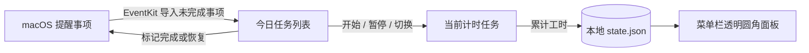
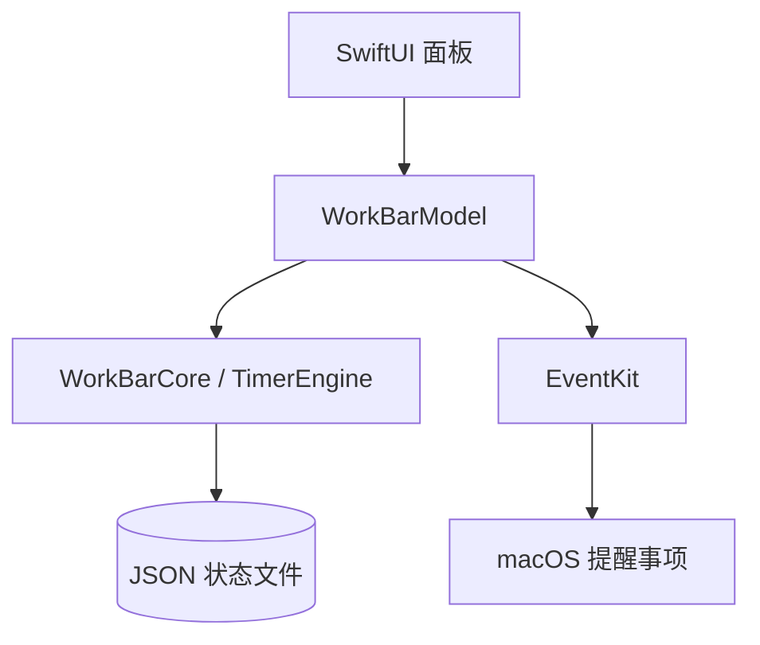

# WorkBar ⏳

> 一个安静地待在 macOS 菜单栏里的本地专注计时器：把今天的工作预算分给任务，随时开始、暂停、切换，并把完成状态同步回提醒事项。

[](#安装与运行)
[](#首次启动)
[](#数据与隐私)
[](#项目状态)
[](https://github.com/nxZhai/WorkBar)

<p align="center">
  
</p>

<p align="center">
  <em>当前界面：透明圆角面板、今日预算、提醒事项任务和内联预算编辑。</em>
</p>

WorkBar 采用原生 macOS 菜单栏技术路线，面向个人离线任务计时进行设计。

## 为什么做 WorkBar

日程里常常同时有几件事：英语、写代码、阅读、会议准备。WorkBar 把一天的可用时间拆成多个任务预算，每个任务都像一个可以反复翻转的沙漏：

1. 为今天设定总工作预算。
2. 为任务分配预算，例如英语 2 小时、代码 4 小时。
3. 开始一个任务；卡住、休息或切换上下文时暂停。
4. 思路回来后继续同一个任务，累计时间不会丢失。
5. 完成提醒事项中的任务时，自动写回 macOS“提醒事项”。

## 一眼看懂



## 核心功能

| 功能 | 说明 |
| --- | --- |
| 今日预算 | 设置当天总工作时间，显示已分配、未分配或超额分配。 |
| 独立任务沙漏 | 每个任务有自己的预算、已用和剩余时间；同一时刻只运行一个任务。 |
| 开始 / 暂停 / 切换 | 切换任务前先结算当前任务，暂停后可以继续累计。 |
| 任务管理 | 从提醒事项同步任务，并支持编辑、排序、删除和完成。 |
| 进度反馈 | 任务卡片背景色表达剩余时间，超时后继续计时并显示超时状态。 |
| 长内容展开 | 长任务标题点击后展开完整内容，再次点击收起。 |
| 提醒事项同步 | 启动同步、顶部刷新、每 15 分钟自动同步；完成状态支持写回。 |
| 历史记录 | 按日保留计划和累计工时。 |
| 本地优先 | 所有计时数据保存在本机，应用离线运行。 |

## 菜单栏体验

- 作为菜单栏应用常驻，Dock 图标保持隐藏。
- 点击 hourglass 图标打开无箭头的透明圆角面板。
- 面板底部使用纵向操作列表：内联编辑`今日预算`、查看`历史`。
- 任务行采用“左侧可伸缩内容 + 右侧固定控制区”，长标题自动截断并保持控制区稳定。
- 面板关闭后可以再次从菜单栏打开；点击外部区域会关闭面板。

## 安装与运行

WorkBar 通过 [GitHub Releases](https://github.com/nxZhai/WorkBar/releases/latest) 发布 macOS 应用：

1. 下载 `WorkBar-0.1.0.zip` 并解压。
2. 将 `WorkBar.app` 拖入“应用程序”文件夹。
3. 打开 WorkBar，按提示授予提醒事项访问权限。

当前版本使用本地 ad-hoc 签名。macOS 首次拦截打开时，在“应用程序”中右键 `WorkBar.app`，选择“打开”。

## 首次启动

1. 点击菜单栏中的 WorkBar hourglass 图标。
2. macOS 首次访问提醒事项时，允许 WorkBar 使用 Reminders Full Access。
3. 点击任务区域顶部的刷新按钮同步未完成提醒事项。
4. 在主界面直接修改今日预算（单位为分钟），WorkBar 会自动保存。
5. 点击任务行的开始按钮开始计时。
6. 完成从提醒事项导入的任务后，WorkBar 会同步更新原提醒事项。

提醒事项权限可在“系统设置 → 隐私与安全性 → 提醒事项”中重新开启；权限不可用时，手动任务继续可用。

## 数据与隐私

WorkBar 的数据边界很小：



- 本地计时状态保存到 `$HOME/Library/Application Support/WorkBar/state.json`。
- 保存使用 Codable 和原子替换；JSON 损坏时保留原文件并报告错误。
- 提醒事项通过 EventKit 在本机访问，任务标题、工时和权限信息留在本机。
- 应用功能通过本地文件系统与 EventKit 完成，数据边界限定在本机。
- 导入任务保存 EventKit 唯一 ID，用于去重、标题更新和完成状态写回。

## 技术架构

```text
Sources/
├── WorkBarCore/
│   ├── Models.swift       # TaskItem、DayPlan、AppState
│   ├── TimerEngine.swift  # 开始、暂停、切换、跨日和预算规则
│   └── StateStore.swift   # Codable JSON 原子持久化
└── WorkBar/
    ├── WorkBarApp.swift       # NSStatusItem、NSPanel、生命周期
    ├── WorkBarModel.swift     # Observation UI 状态和同步编排
    ├── WorkBarView.swift      # SwiftUI 面板和任务编辑界面
    └── RemindersImporter.swift # EventKit 读取和状态写回
```

技术选择：

- AppKit 管理 `NSStatusItem`、`NSPanel`、睡眠通知和面板生命周期。
- SwiftUI 管理透明材质面板、任务列表和编辑 sheet。
- Observation 管理主线程 UI 状态。
- 依赖范围限定为 Apple 框架和 Swift 标准库。

## 产品范围

WorkBar 聚焦个人本地工作计时，后续路线包括：

- 团队协作、账号与跨设备同步
- Web、iOS 和其他平台客户端
- 日历集成、标签系统与番茄钟
- AI 排程、统计图表与自动更新

## 项目状态

WorkBar 提供可下载的本地 MVP。核心计时、持久化、提醒事项导入/写回、透明菜单栏面板和紧凑任务布局已经实现，安装包通过 GitHub Releases 发布。
