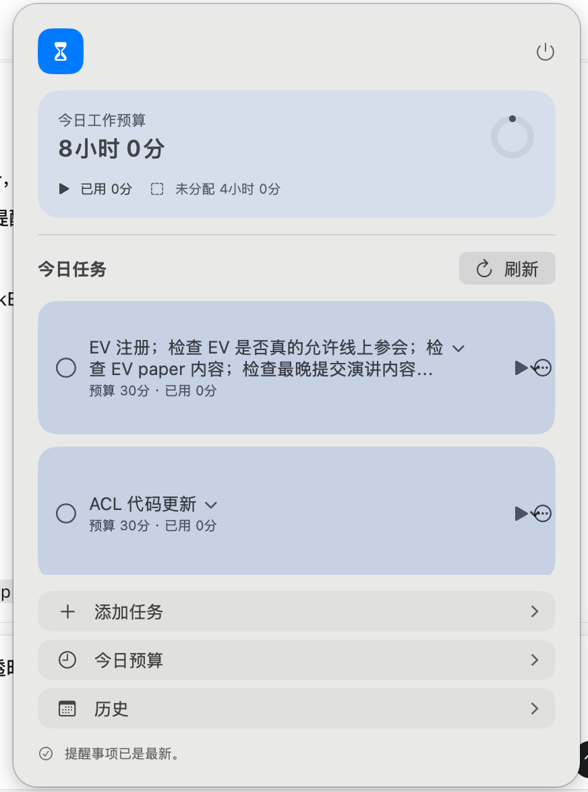
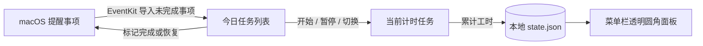
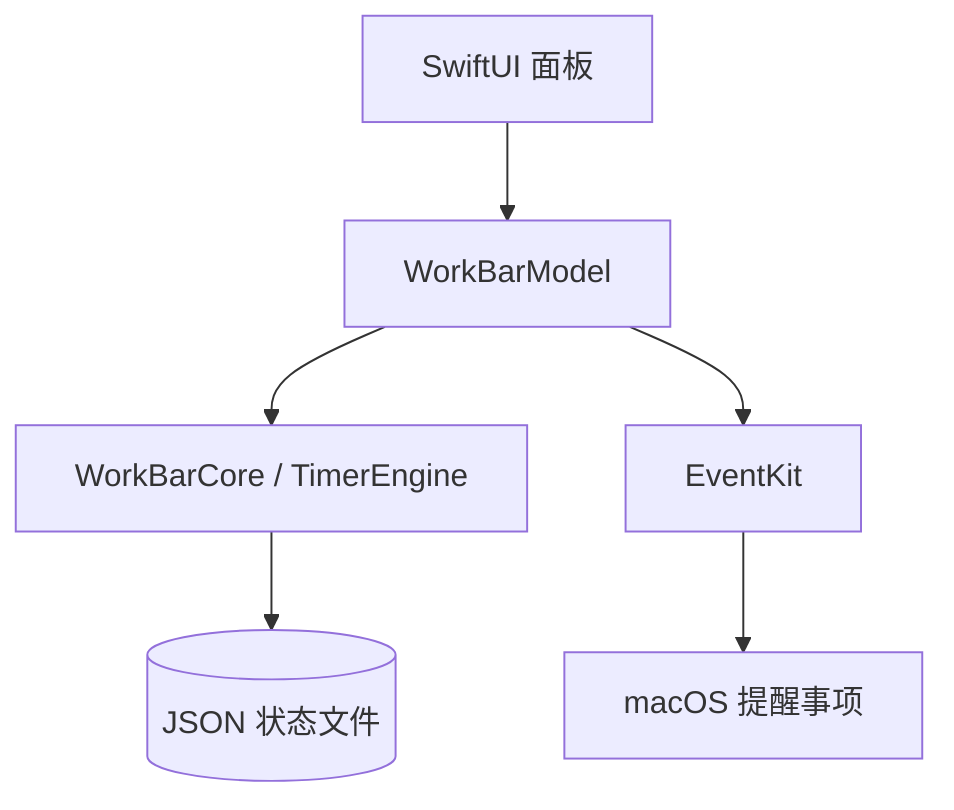

# WorkBar ⏳

> 一个安静地待在 macOS 菜单栏里的本地专注计时器：把今天的工作预算分给任务，随时开始、暂停、切换，并把完成状态同步回提醒事项。

[](#安装与运行)
[](https://www.swift.org/)
[](#安装与运行)
[](#开发与验证)
[](#首次启动)
[](#数据与隐私)
[](#项目状态)
[](https://github.com/nxZhai/WorkBar)

<p align="center">
  
</p>

<p align="center">
  <em>界面示意：透明圆角面板、今日预算、任务计时和纵向操作列表。</em>
</p>

WorkBar 参考 [CodexBar](https://github.com/steipete/CodexBar/) 的 macOS 菜单栏承载方式和 README 信息组织方式，只借鉴原生技术路线，不复制其业务、代码或素材。

## 为什么做 WorkBar

日程里常常同时有几件事：英语、写代码、阅读、会议准备。WorkBar 把一天的可用时间拆成多个任务预算，每个任务都像一个可以反复翻转的沙漏：

1. 为今天设定总工作预算。
2. 为任务分配预算，例如英语 2 小时、代码 4 小时。
3. 开始一个任务；卡住、休息或切换上下文时暂停。
4. 思路回来后继续同一个任务，累计时间不会丢失。
5. 完成提醒事项中的任务时，自动写回 macOS“提醒事项”。

## 一眼看懂



## 核心功能

| 功能 | 说明 |
| --- | --- |
| 今日预算 | 设置当天总工作时间，显示已分配、未分配或超额分配。 |
| 独立任务沙漏 | 每个任务有自己的预算、已用和剩余时间；同一时刻只运行一个任务。 |
| 开始 / 暂停 / 切换 | 切换任务前先结算当前任务，暂停后可以继续累计。 |
| 任务管理 | 添加、编辑、排序、删除和完成今日任务。 |
| 进度反馈 | 任务卡片背景色表达剩余时间，超时后继续计时并显示超时状态。 |
| 长内容展开 | 长任务标题点击后展开完整内容，再次点击收起。 |
| 提醒事项同步 | 启动同步、顶部刷新、每 15 分钟自动同步；完成状态支持写回。 |
| 历史记录 | 保留跨日计划和累计工时，不保存无意义的逐秒快照。 |
| 本地优先 | 不联网、不登录、不使用云同步或遥测。 |

## 菜单栏体验

- 常驻 macOS 菜单栏，不显示 Dock 图标。
- 点击 hourglass 图标打开无箭头的透明圆角面板。
- 面板底部使用纵向操作列表：`添加任务`、`今日预算`、`历史`。
- 任务行采用“左侧可伸缩内容 + 右侧固定控制区”，长标题不会挤压开始/暂停和菜单按钮。
- 面板关闭后可以再次从菜单栏打开；点击外部区域会关闭面板。

## 安装与运行

当前项目以源码构建为主，要求：

- macOS 14 Sonoma 或更高版本
- Swift 6.2 或更高版本
- 可用的 SwiftPM / Apple 开发工具链

先确认工具链：

```bash
xcode-select -p
swift --version
swift package describe
```

构建、打包并启动：

```bash
./Scripts/package_app.sh
open WorkBar.app
```

`package_app.sh` 会完成 Release 构建、生成 `Info.plist`、设置 `LSUIElement=true`，并使用固定 designated requirement 进行本地 ad-hoc 签名。

## 首次启动

1. 点击菜单栏中的 WorkBar hourglass 图标。
2. macOS 首次访问提醒事项时，允许 WorkBar 使用 Reminders Full Access。
3. 点击任务区域顶部的刷新按钮同步未完成提醒事项。
4. 设置今日总预算，或直接为任务调整预算。
5. 点击任务行的开始按钮开始计时。
6. 完成从提醒事项导入的任务后，WorkBar 会同步更新原提醒事项。

如果权限被拒绝，可以在“系统设置 → 隐私与安全性 → 提醒事项”中重新开启。权限不可用时，本地手动任务仍然可以使用。

## 数据与隐私

WorkBar 的数据边界很小：



- 本地计时状态保存到 `$HOME/Library/Application Support/WorkBar/state.json`。
- 保存使用 Codable 和原子替换；JSON 损坏时不覆盖原文件。
- 提醒事项只通过 EventKit 访问，不上传任务标题、工时或权限信息。
- 没有账号、服务器、网络 API、遥测或远程数据库。
- 导入任务保存 EventKit 唯一 ID，用于去重、标题更新和完成状态写回。

## 技术架构

```text
Sources/
├── WorkBarCore/
│   ├── Models.swift       # TaskItem、DayPlan、AppState
│   ├── TimerEngine.swift  # 开始、暂停、切换、跨日和预算规则
│   └── StateStore.swift   # Codable JSON 原子持久化
└── WorkBar/
    ├── WorkBarApp.swift       # NSStatusItem、NSPanel、生命周期
    ├── WorkBarModel.swift     # Observation UI 状态和同步编排
    ├── WorkBarView.swift      # SwiftUI 面板和任务编辑界面
    └── RemindersImporter.swift # EventKit 读取和状态写回
```

技术选择：

- AppKit 管理 `NSStatusItem`、`NSPanel`、睡眠通知和面板生命周期。
- SwiftUI 管理透明材质面板、任务列表和编辑 sheet。
- Observation 管理主线程 UI 状态。
- Swift Testing 覆盖计时、切换、跨日和持久化等核心规则。
- 首版不添加第三方运行时依赖。

## 开发与验证

运行核心测试：

```bash
swift test --parallel
```

UI 或发布前执行完整检查：

```bash
git diff --check
./Scripts/package_app.sh
codesign --verify --deep --strict WorkBar.app
open WorkBar.app
```

人工回归重点：

- 菜单栏图标可以打开、关闭并再次打开面板。
- 面板没有顶部三角，背景保持透明/半透明圆角材质。
- 任务长标题不会覆盖右侧开始/暂停和菜单按钮。
- 提醒事项权限、刷新、自动同步和完成状态写回正常。
- 睡眠、退出重开和跨日不会错误增加工时。

更完整的项目规则见 [AGENTS.md](AGENTS.md)，开发路线见 [DevelopPlan.md](DevelopPlan.md)。

## 当前边界

WorkBar 目前专注于个人本地工作计时，暂不包含：

- 团队协作、账号和跨设备同步
- Web、iOS 或其他平台客户端
- 日历集成、标签系统和番茄钟
- AI 排程、统计图表和自动更新

这些能力只有在现有本地模型无法满足需求时才考虑加入。

## 项目状态

WorkBar 处于可运行的本地 MVP 阶段。核心计时、持久化、提醒事项导入/写回、透明菜单栏面板和紧凑任务布局已经实现；正式发布前仍需要在解锁的 Mac 环境完成一次完整的人工菜单栏与权限回归。
