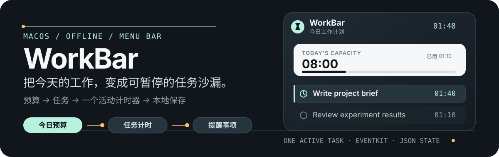

# WorkBar ⏳

> macOS 菜单栏里的本地工作预算计时器：给今天设定容量，把时间分配给任务，随时开始、暂停、切换，并把完成状态同步回提醒事项。

<p align="center">
  
</p>

<p align="center">
  <a href="#安装与运行">开始使用</a> ·
  <a href="#首次启动">提醒事项同步</a> ·
  <a href="#数据与隐私">本地与隐私</a>
</p>

<p align="center">
  
  
  
  
</p>

## 🧭 WorkBar 是什么

WorkBar 把一天的可用时间拆成多个任务预算。每个任务都有自己的已用时间和剩余时间，但同一时刻只运行一个活动计时器：暂停、切换或重新打开应用，都不会丢失已经记录的工时。

## 👀 先看界面

<p align="center">
  
</p>

面板把最常用的动作放在一处：查看今日预算、开始或暂停任务、编辑预算、刷新提醒事项，以及查看历史。任务卡片会显示预算、已用和剩余；预算耗尽后仍会继续计时，并明确标出超时。

## 🚀 使用方式

1. 为今天设定一个总工作预算，例如 `8 小时`。
2. 给英语、写代码、阅读等任务分配预算。
3. 开始一个任务；需要休息或切换上下文时暂停，回来后继续同一个任务。
4. 切换到另一个任务时，WorkBar 会先结算当前任务，再启动目标任务。
5. 完成从提醒事项导入的任务后，状态会写回 macOS“提醒事项”。

### ⏱️ 计时规则

| 规则 | WorkBar 的行为 |
| --- | --- |
| 任务预算用完 | 继续计时，不丢弃超出的工时，并显示“超时”。 |
| 任务切换 | 用同一个时间点结算旧任务，再启动新任务。 |
| 系统睡眠 | 睡眠前自动暂停，避免把睡眠时间算进工时。 |
| 应用退出 | 退出前结算并保存，重新打开后继续今日计划。 |
| 日期切换 | 结束前一天的活动计时，保留历史并创建新的今日计划。 |
| 总预算与任务预算 | 两者独立计算：少分配显示“未分配”，多分配显示“超额”。 |

## ✨ 功能一览

- **今日预算**：显示总预算、已用、已分配，以及未分配或超额分配。
- **独立任务沙漏**：每个任务可以开始、暂停、恢复、完成、重命名、排序、调整预算或删除。
- **提醒事项同步**：启动时同步，面板顶部手动刷新，每 15 分钟自动同步一次。
- **完成状态写回**：只有从提醒事项导入的任务会写回 EventKit；手动任务保持本地。
- **本地历史**：按日保留计划和累计工时，不保存逐秒快照。
- **紧凑菜单栏体验**：隐藏 Dock 图标，使用无箭头透明圆角面板，支持浅色/深色模式和 VoiceOver 标签。

## 🛠️ 安装与运行

### 🔨 从源码构建

要求 macOS 14+、Swift 6.2+ 和可用的 Apple 开发工具链。

```bash
git clone https://github.com/nxZhai/WorkBar.git
cd WorkBar

swift test --parallel
./Scripts/package_app.sh
open WorkBar.app
```

`package_app.sh` 会构建 Release 版本、组装 `.app`、设置 `LSUIElement=true`，并使用固定 designated requirement 进行本地 ad-hoc 签名。

首次被 macOS 拦截时，在“应用程序”中右键 `WorkBar.app`，选择“打开”。

## 🔔 首次启动

1. 点击菜单栏中的 WorkBar hourglass 图标。
2. 首次访问提醒事项时，允许 WorkBar 使用 Reminders Full Access。
3. 点击任务区域顶部的刷新按钮，导入带预算前缀的未完成提醒事项，例如 `[1h] 写项目说明`。
4. 直接编辑今日总预算和任务预算，然后点击任务行的开始按钮。

没有合法预算前缀的提醒事项不会被导入；权限被拒绝或不可用时，手动创建的本地任务仍然可以使用。权限可在“系统设置 → 隐私与安全性 → 提醒事项”中重新开启。

## 🔒 数据与隐私

WorkBar 不要求登录、不使用云同步、不发起网络请求，也不使用遥测。

- 计时状态保存到 `~/Library/Application Support/WorkBar/state.json`。
- 使用 Codable 编码和原子替换；保存失败或 JSON 损坏时保留有效数据。
- 提醒事项只通过本机 EventKit 访问，导入任务保留 EventKit 唯一 ID 用于去重和完成状态写回。
- UI 刷新不会每秒写磁盘；只有暂停、切换、编辑、睡眠、跨日和退出等真实状态变化才会结算并保存。

## 🧱 技术结构

```text
Sources/
├── WorkBarCore/
│   ├── Models.swift          # TaskItem、DayPlan、AppState
│   ├── TimerEngine.swift     # 开始、暂停、切换、跨日和预算规则
│   └── StateStore.swift      # Codable JSON 原子持久化
└── WorkBar/
    ├── WorkBarApp.swift          # NSStatusItem、NSPanel、生命周期
    ├── WorkBarModel.swift        # Observation 状态和同步编排
    ├── WorkBarView.swift         # SwiftUI 面板和任务编辑界面
    └── RemindersImporter.swift   # EventKit 读取和状态写回
```
